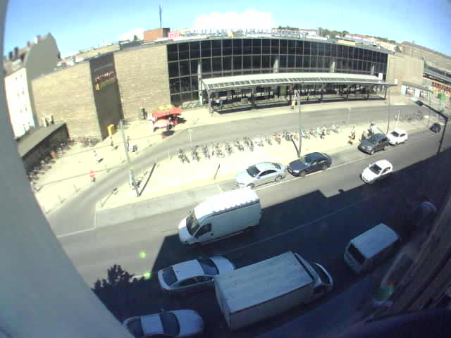
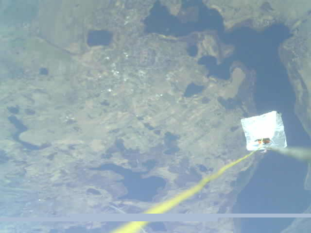
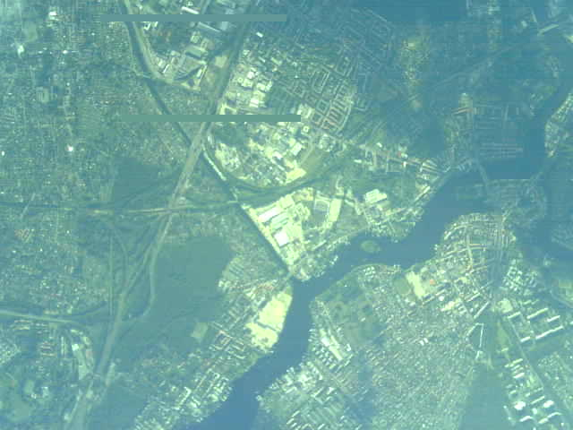

# Pecan Pico 9 - A lightweight APRS tracker for balloons
This Project contains the Pecan Pico project in it's 9th version. A Pecan is a cheap lightweight APRS position tracker designed especially for small ballons which may fly for monthes. This tracker has been made in respect of weight, functionality and price because it's usually used once like a satellite. While the balloon can fly for a long time, this tracker is solar powered and recharges it's battery at daytime.

Other than usual position tracker, this tracker has also the ability to take pictures with a camera and send them to the ground. Therefore the APRS protocol has been extended by the SSDV protocol which can be received by any generic APRS receiver and some decoding software on the computer. SSDV can be also used with 2FSK (RTTY) but APRS may be used on the APRS network which provides APRS Igates. So you could make use of them and receive APRS messages from far away through the Internet. While the tracker has the ability to transmit 2GFSK (better known as 9k6 APRS), you may transmit pictures at a much higher rate. VGA sized pictures can be transmitted within minute.

The camera which is used on the Pecan (OV2640) may sample pictures up to UXGA but transmitting those still might take some time. The standard camera can be bought for roughly US$5. It can be replaced by a wide angular camera which is available on the market too. Please don't expect high quality images. VGA sized pictures are okay but you might see the bad quality if you ramp up the resolution.

 
*Closed Airport Berlin Tempelhof roughly 3km (10,000ft) altitude*

 
*Test picture from the ground*

 
*Lakes in East Poland at 16km (51,000ft) altitude*

 
*South East Berlin taken at roughly 5km (16,000ft) altitude*
